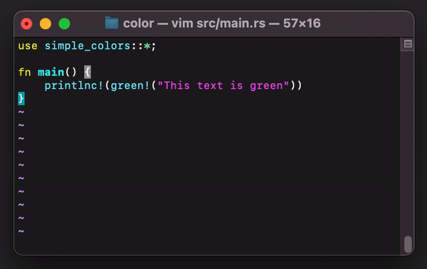
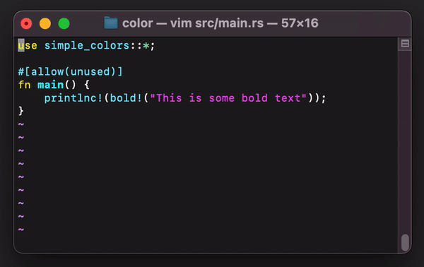
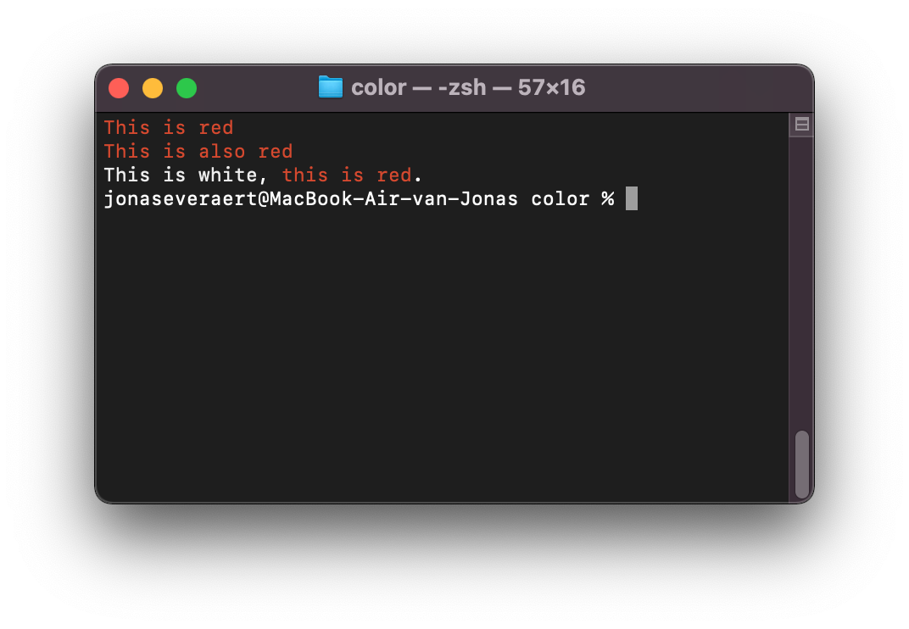

# Simple Colors
This crate provides simple macros for formatting strings with colors, backgrounds and styles like bold, italic and underlined.
The crate does not use any external dependencies.

<div>
    
    
    
    
</div>

## Installing
Add the following line to your **Cargo.toml** file:
```toml
[dependencies]
simple_colors = "1"
```

*Just hang on a few minutes until this crate has been published to cargo!*

## Overview

### Colors
You can style text with colors:

```rust
use simple_colors::{white, red, printlnc};
println!("{}", red!("This is red"));
printlnc!(red!("This is also red"));
printlnc!(format!("{}, {}.", white!("This is white"), red!("this is red")))
```

**Output:**



The available colors:
- black
- white
- yellow & light_yellow
- red & light_red
- cyan & light_cyan
- blue & light_blue
- magenta & light_magenta
- green & light_green
- dark_grey & grey

[Preview](preview.md)

### Backgrounds
You can also add backgrounds:
```rust
use simple_colors::{white, bg_black, printlnc};

printlnc!(bg_black!(white!("Black background with white text")));
```


### Styles
You can also make your text bold, italic or underlined.

```rust
use simple_colors::bold;

printlnc!(bold!("This text is bold"));
```

### Combining styles
You can combine all of the different macros to style your text.


### Custom styles
You can also specify custom styles:

```rust
use simple_colors::{color, Color, Style};

enum MyCustomStyles {
    Style1,
    Style2
}
impl simple_colors::custom::Style for MyCustomStyles {
    fn get_style_code(&self) -> String {
        match self {
            // Style1 will be bold and light blue
            MyCustomStyles::Style1 => "\x1b[1m\x1b[94m".to_string(),
            // Style2 will be bold and red
            MyCustomStyles::Style2 =>
                format!(
                    "{}{}",
                    Style::Bold.get_style_code(),
                    Color::Red.get_style_code()
                )
        }
    }
}
 println!("{}", color!(MyCustomStyles::Style2, "Some text that is both bold and red"))
```

## Contributing
Everything should be covered in this crate. If you find a bug, feel free to open an issue and then making a pull request
(if you know how to fix the bug). If you can think of improvements, they are also always welcome.

## License
This crate is licensed under the [MIT License](LICENSE) or the Apache-2.0 license.